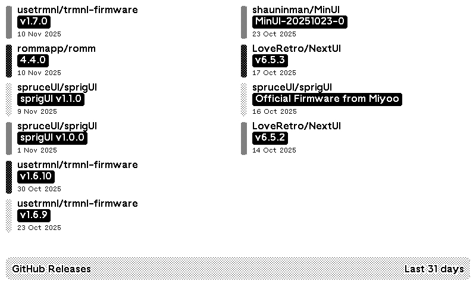

# tmrnl-github-releases-plugin
This repository contains the plugin-data for the TRMNL Github Releases plugin.

You can also report any issues with the plugin here.

<!-- PLUGIN_STATS_START -->
## 🚀 TRMNL Plugin(s)

*Last updated: 2025-11-15 06:34:38 UTC*

##  [Github Releases](https://usetrmnl.com/recipes/176802)

### Description
Display the latest GitHub releases from your monitored repositories with powerful filtering options.   <strong>Features:</strong>  ● Filter by time period (show releases from last N days)  ● Include or exclude pre-releases  ● Include or exclude draft releases  ● Show only the latest release per repository  ● Show time since previous release for a project  ● Multi-language support

### 📊 Statistics

| Metric | Value |
|--------|-------|
| Installs | 1 |
| Forks | 11 |

---

<!-- PLUGIN_STATS_END -->